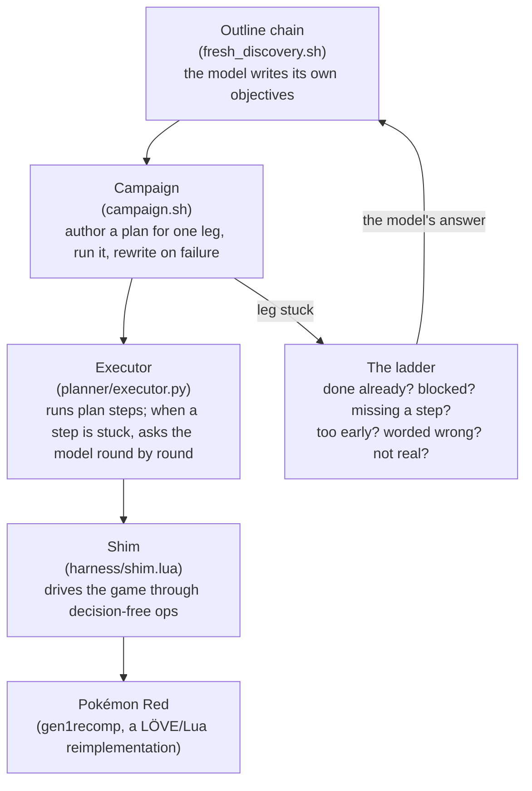
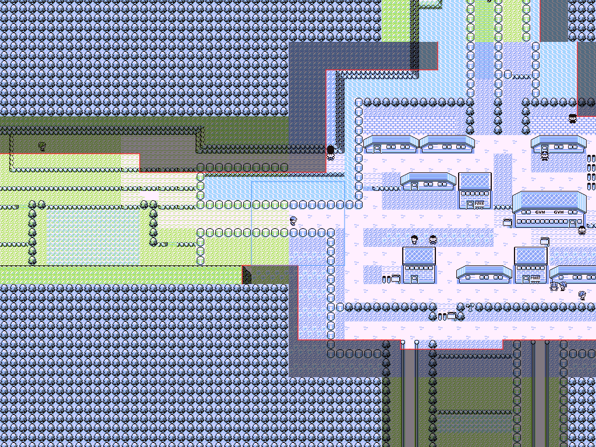

# open-red

**Working toward the first unassisted finish of Pokémon Red by an open-weights LLM, on one local GPU.**

-4285F4)


[](LICENSE)

open-red is a harness and planner built so that a 31B open-weights model (Gemma 4,
Q4, served by Ollama on a single Radeon AI PRO R9700) can play the whole of Pokémon
Red on its own.
The model writes its own list of objectives, plans each one, chooses every move in
the overworld, writes its own battle policy, and decides what to do when it is
stuck. Nothing goes over the network.

The harness has one job: **tell the model the truth about what is on screen, and
then get out of the way.** It drives the game and reports what happened. It never
decides where to go or what to do next.

> **Where it stands:** the goal, a run that goes from a new game to the Hall of Fame
> with nobody touching it, **has not been reached yet.** Five runs have reached the
> Hall of Fame on outlines the model wrote itself (the first on 2026-08-28), but all
> five were assisted: they were stopped mid-run so the harness could be fixed, then
> relaunched, and some needed hand corrections to the outline or the run's records.
> They show the capability is there; they are not the claim. Each run since is an
> attempt at the untouched finish, and each stop has turned into a fix.

---

## Why this is interesting

Frontier models have finished Pokémon (Claude, Gemini and GPT all have). A local
31B model on consumer hardware is a different problem: it has a smaller window,
weaker spatial reasoning and far less world knowledge, and it cannot be prompted
past its limits with more tokens. Getting it this far has come down to
engineering the *information*, not the model:

- **No hidden state, no game knowledge.** The model sees only what a player could
  see: the screen, the bag, what people said, and the game's own manual. The
  harness knows nothing about where things are in Kanto and will not hint.
- **It plans for itself.** The model writes the outline (around 50 to 60 legs, from
  "pick a starter" to "become the Champion"), then authors a plan for each leg
  with machine-checkable completion conditions.
- **It recovers from its own mistakes.** When a leg is stuck, a "ladder" of questions
  lets the model decide whether the leg is already done, blocked by something else,
  in the wrong place in the list, worded wrong, or not real. The harness only
  carries out the answer.
- **It writes its own battle strategy.** Fights are played by a policy the model
  authors in a small DSL, scored against arena rooms built from real save states.

## How it works



**The model never presses a button.** It sends *ops* (31 of them: `walk_to`,
`cross`, `interact`, `use_warp`, `explore`, `field_move`, `buy`, `use_item`,
`elevator`, `blocked`, ...). Each op is decision-free: it does exactly what it
says, or explains precisely why it could not.

**Every round the model gets a page**, built from the run's own record:

- where it stands, and what on this floor it has never tried;
- the walls that turned it back, and what each one said;
- its own recent plans quoted back to it, marked as what it *believed*, not as fact;
- what people have told it, with "notable" things several voices mentioned grouped
  together.

Nothing on the page is a hint the run has not earned.

## The rule everything is built on

> **Stop lying, stop hiding, stop refusing, and never point.**

Almost every bug worth fixing has been one of four things the harness was doing to
the model:

| Failure | What it looked like |
| --- | --- |
| **Lying** | Telling the model it had cleared Rock Tunnel when every exit it took led back the way it came. |
| **Hiding** | A walked-map dump eating 21,958 of a 22,000-character budget, leaving 70 characters of what actually happened. |
| **Refusing** | A validator rejecting "Pay the toll on Route 24" because "ROUTE2" appeared inside "ROUTE24" with the spaces stripped. |
| **Pointing** | An auto-sweep walking the party across a city to cut a tree that blocked nothing. |

Pointing counts as a bug even when it helps. A run that only succeeds because the
harness steers is not the thing being built. Two working rules follow from this:

- **An illogical choice is a harness gap.** Wrong *facts* are the model's problem. A
  choice that is illogical *given what it was shown* is ours to fix.
- **Prove the model can before saying it won't.** Five separate times, "the model
  just won't do X" turned out to be a signal that never reached it.

## Engineering highlights

- **A visibility mask, not a map.** A tile counts as seen only once it has been inside
  the game's own 10×9 viewport. The mask persists across reboots, and every route, door
  and "untried" claim is gated on it.
- **An exploration ledger.** It records what was walked, what was pressed and what said
  what, plus the ways that turned the run back. Blockers clear themselves when the party
  can deal with them (a Cut tree stops counting once someone knows Cut and has the
  badge).
- **A recovery ladder with guards.** Every rung's answer is the model's, but each one is
  checked against the run's own record. A leg cannot be voided while the person it
  names stands there unspoken-to, and a pull cannot jump ahead of what it waits on.
- **"Roll with it."** After an attempt that covered real ground, the model is asked
  whether it has stumbled into a later objective. If so, that objective moves to the
  front.
- **A model-authored battle policy.** A small DSL (move classes, item rules, switching,
  training), authored by the model and scored in arenas built from real save files of
  past runs.
- **Run analytics.** Every prompt is journaled whole (`run/prompts.jsonl.gz`). There are
  tools to compare runs leg by leg (`planner/arc.py`), replay from any leg boundary
  (`replay_from.sh`), and measure which page sections actually change decisions
  (`tools/page_ablation.py`).
- **Over 680 tests, named as sentences.** Most were written the day a run failed, and each
  docstring is the incident report: what the model was told, what it did, and what it
  should have been told.

  ```
  a_round_can_say_its_step_is_blocked.py
  a_void_waits_for_the_person_it_names.py
  a_run_rolls_on_with_what_it_stumbled_into.py
  new_ground_is_progress_and_a_won_fight_does_not_end_a_look.py
  ```

## Watching a run

`tools/hud.py` is the run on half a screen, made to sit beside the game in a
[kitty](https://sw.kovidgoyal.net/kitty/) window. On the left is the team: each
Pokémon's picture, level, types, HP bar and moves, under the badges earned so far.
On the right is what the model is doing: the leg, the current step and its completion
condition, the model's reasoning in its own words, the op in flight, and what the game
said back. A MODEL line says what the model is doing this second (reading its prompt,
writing, thinking, or waiting while the harness plays), and an events feed underneath
keeps the run's recent history: legs finished, plans drafted and picked, steps that
failed.

<!-- The HUD screenshot goes here, as docs/hud.png. `tools/hud.py --png docs/hud.png` writes one frame. -->

```bash
tools/events.py --follow &    # writes the events feed the HUD shows
tools/hud.py                  # live, in this kitty window
```

Both only read the run, so they are safe beside a live chain. The HUD draws the team
with the pictures and the font the game extracted from your own ROM, so none of that is
in this repository.

Without kitty, `run/status.txt` is the same status as plain text
(`watch -n1 cat run/status.txt`):


For viewers, the game window shows the model's knowledge: ground it has seen is lit,
ground it has never seen is dimmed, and a red line marks the edge. The shading
carries on across every connected map in view.



## Running it

**Requirements**

- [Ollama](https://ollama.com) with `gemma4:31b-it-q4_K_M` (about 23 GB of VRAM at a
  32k context).
- [pokemon-gen1-recomp-project](https://github.com/bryanthaboi/pokemon-gen1-recomp-project),
  a LÖVE reimplementation of Red by someone else, checked out at `~/Developer/gen1recomp`.
- LÖVE 11.5, Python 3.10+ (developed on 3.14), LuaJIT.
- For the HUD only: a kitty terminal and [Pillow](https://python-pillow.github.io).

**Start a fresh run** (the chain authors an outline if none is banked):

```bash
rm -f run/outline_leg
RED_NUM_CTX=32768 ./fresh_discovery.sh 4
tools/hud.py                      # follow along (or: watch -n1 cat run/status.txt)
./stop_all.sh                     # stop everything this rig started, and verify it
```

**Tests:**

```bash
tests/run_suite.sh    # every no-game test, in parallel (about 10 seconds)
```

A few tests boot a second copy of the game (listed in the script); never run those
next to a live chain.

## Repository map

| Path | What it is |
| --- | --- |
| `fresh_discovery.sh` | The outline chain and the recovery ladder |
| `campaign.sh` | One leg: run, rewrite from evidence on failure |
| `planner/executor.py` | Runs plans; builds each round's page; talks to the model |
| `planner/author.py` | Outline and plan authoring, the validator, and every ladder rung |
| `planner/ledger.py` | The per-floor candidate list (what is untried, what is done) |
| `planner/battle_policy.py` | The battle policy DSL |
| `planner/policy_author.py` | Arena evaluation of authored policies |
| `harness/shim.lua` | The in-game driver: ops, observation, visibility mask, overlay |
| `tools/hud.py`, `tools/events.py` | The run HUD and the events feed it shows |
| `tools/` | Analysis: arena tables, calibration, page ablation, world map |
| `SPD_DESIGN.md`, `EXPLORE_DESIGN.md` | Design notes |

## Credits

The game itself is [pokemon-gen1-recomp-project](https://github.com/bryanthaboi/pokemon-gen1-recomp-project)
by bryanthaboi. open-red only drives it, and is not involved in or affiliated with that
project; it uses it because Lua source is far easier to read and instrument than
emulator RAM. No ROM and no game assets are in this repository. Pokémon is © Nintendo,
Creatures Inc. and GAME FREAK inc.

## License

open-red's own code is under the [MIT License](LICENSE). That covers this repository
only, not the game or the project it drives.
